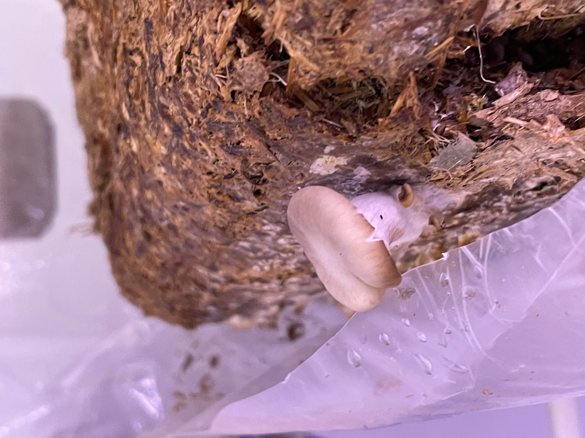

<h1 align="center"> Digital Portfolio 🚀</h1>

## Education
- B.S. Aerospace Engineering, Florida Institute of Tecnhology, USA (_May 2025_)
  - Study Abroad (Calculus 3 and British Literature), University of Oxford, UK (_June 2022 - August 2022_)
- _Graduate School loading..._
  
## Skills, Languages & Co-curriculars
**Engineering Skills**

Creo PTC, Fusion 360, NX Siemens, MATLAB, Simulink, Python, C++, MS Office, 3D Printing, Laser Cutting, Soldering

**Languages**

Italian (mother-tongue), English (Bilingual knowledge), Spanish (School-level)

**Soft Skills**

Team-work, Project Management, Communication, Problem Solving, Adaptability

**Co-curriculars**

WAE (Women in Aerospace Engineering), AIAA (American Institute of Aeronautics & Astronautics), ARES (Astrobiological Research & Education Society)

## Current Main Project: 
### Project DROVER (Drone Rover Operations on Versatile Extra-hazardous Regions)
The primary objective of Project DROVER is to design, build, and fly a drone-rover hybrid prototype designed to enhance search and rescue operations capable of aerial and terrestrial navigation to locate and assist people in distress. This prototype will demonstrate the unique capability to land and drive when traversal via flying is not possible. Additionally, the vehicle will showcase the ability to execute turning maneuvers while airborne and land at an inclined angle. This hybrid vehicle holds the potential to revolutionize search and rescue operations by harnessing the energy efficiency of a rover combined with the agile air mobility of a drone. 
The unique dual-mode design of the DROVER opens a new wide range of possibilities for the utilization of technology to positively impact human lives. Its design is easily interchangeable to accommodate different possible versions (for example, to assist agriculture, military operations, search and rescue, and inspection of hazardous areas). 
This particular version will be focused on search and rescue operations, which often struggle with limited accessibility and time constraints. The DROVER will address these issues by providing quick and versatile navigation through both air and land. This version of DROVER targets emergency response units, including fire departments, search and rescue teams, and disaster relief organizations, aiming to improve their operational efficiency and effectiveness in challenging terrains. 

•	Deliverables: SRR (completed), PDR (Dec. 2024), CDR (Apr. 2025), _Poster and Presentation_ at the Northrop Grumman Engineering & Science Student Design Showcase (Apr. 2025)

## Research Experience
### Project ASTTRO (Astronomy Space Telescope Thermal Research and Optimization) (_November 2023 - August 2024_)
**SPACE Lab - Dr. do Vale Pereira**

The project's main objective is to propose a design for a large observatory that will orbit around Earth in a highly eccentric orbit with an apoapsis close to the lunar orbit. My role was more focused on the thermal aspects of the telescope; Calculating the effects of the thermal environment on the telescope structure, with more emphasis on the mirrors to check for survivability and optical stability in given conditions. 
Engaging in research has proven to be an exceptional experience. The practical application of knowledge acquired from lectures and laboratories has made me aware of the importance of details and how vital interconnections between different subjects are in engineering projects, highlighting the importance of teamwork in developing a high-quality project. 

[**Publication on SPIE Click Here**](https://doi.org/10.1117/12.3020407)

**ASTTRO Team in front of the TVAC at University of Arizona**

### RedHouse Project – Dr. Andrew Palmer Laboratory (_September 2021 – May 2022_)
I have volunteered in Dr. Andrew Palmer’s “Red House”, a greenhouse where I tended to tomato plants grown in conditions that emulated the ones humans would have to face while farming on Mars; the experiment was so successful that Heinz Tomato Ketchup created a limited run of prototype [bottles “Marz Edition”](https://news.fit.edu/academics-research/heinz-marz-edition-ketchup-made-possible-by-florida-tech-science/) from the crops.

## Work Experience
### Leonardo Helicopters Intern – AWPC, Philadelphia, PA (_May 2024 – Aug 2024_)
•	Worked as an Aircraft System Integration (ASI) Engineering Intern on the Flight Mechanics team of the AW609 (Tilt-Rotor) program

•	Flight Data Analysis. Analyzed mast torque and engine power losses in AW609 flight tests, produced flight envelope plots under varying conditions, and conducted comparative blade studies using programs such as JPanda, PyPanda, iMission, Excel, MATLAB, and Python

•	Conducted compliance checks and formatted test reports and plans, ensuring adherence to established rules and standards

•	Produced performance data tables for the Tokyo Metropolitan Government, supporting potential AW609 operations at Ogasawara and contributing to future business opportunities with TMG.

•	Gained knowledge in helicopter flight mechanics and tiltrotor technologies, actively assisting in telemetry and flight simulations for the AW609 aircraft

## Workforce Developments & Summer Schools
### NASA Mission Concept Academy (_Jan 2024 – May 2024_)
Served as **Deputy Project Manager** in a NASA workforce development program focused on mastering exploration mission protocols and industry practices led by NASA professionals. Collaborated with a team to apply professional practices and procedures, enhancing project management skills and understanding of NASA's exploration processes

•	Deliverables: Team Organizational Chart, MCR, SRR, MDR, PDR, PDR Presentation

### ESA/EGRA Gravity-related Research Summer School – ESEC-Galaxia, Belgium (_June 2023_)
In June 2023, I was selected to be part of the ESA/ELGRA Gravity-Related Summer School, where I got to fly to Belgium and experience a blended format of lectures, workshops, and team activities on altered-gravity experiments. Learning from experts affiliated with ESA and ELGRA, who freely shared their expertise in biology, human physiology, physics, and engineering, has been truly enriching. However, the most rewarding experience has been encountering an incredibly diverse and talented group of young students from universities all over Europe, creating a stimulating and supportive environment. As part of completing the Summer School, we were divided into groups to complete a multidisciplinary team project. The teams were structured to feature completely different backgrounds: engineers, biologists, neuroscientists, and doctors, all from different countries. Diving into unfamiliar subjects made the project challenging; for example, our project consisted of testing human’s attentional load in altered gravity, which focused mostly on neuroscience, something quite different from engineering. It was incredibly gratifying to see how different branches of STEM subjects intertwine and are necessary to one another and how we managed to each use our skills and different backgrounds to achieve a successful experiment. 

### NASA Proposal Writing and Evaluation Experience Academy (_May 2023 – Aug 2023_)
NASA Proposal Writing and Evaluation Experience Academy (NPWEE), a four-month workforce development held by NASA and Arizona State University designed to **teach proposal writing** and enhance effective teaming practices and soft skills. Contributed as an engineer to a team that researched and crafted a New Technology Proposal for NASA, showcasing innovative solutions and technical expertise. Played a key role as a secondary reviewer, assessing and scoring proposals from other teams, which honed critical evaluation skills and provided valuable insights into the proposal review process

•	Deliverables: Taxonomy Topic Interest, Quad Chart, Org Chart, Shell Doc, Proposal, Review Panel

## Others
### Mars Plant Challenge (_Fall 2021 - Spring 2022_)
Although my studies are more focused on airplanes and rockets, I am aware of the importance of all STEM subjects to space exploration. At Florida Tech, I have been very active in the Astrobiological Research and Education Society (ARES), where I have been part of a team of undergraduate students who managed to grow Oyster mushrooms in simulant Martian regolith, with the main objective to understand how to feed a crew in space, maximize resources, and forward all research to NASA’s lunar program Artemis. The team, the “Florida Tech Fungis”, won “Best Plant Growth”, “Most Innovative Experiment”, and “Best Evaluation Results” prizes in the professional division of the competition. 
[Click here to read what Florida Tech wrote about us!](https://news.fit.edu/panther-bites/student-team-wins-best-in-show-at-plant-moon-mars-challenge/?fbclid=IwAR36YlYfje_kMLPEJw-eJnnzu9fiswfn-1FLrZU32aJyluOpPblcj4fR1p8&fs=e&s=cl)

 

### Freshman Design Project (_Spring 2022_)
The purpose of this project was to design and build a glider. The requirements included size  (4 ft x 4 ft x 1 ft) and total mass (4.41lb) constraints. A payload bay had to be included for the accommodation of a small object of 43g (included in the total mass of the glider) and size 4 in x 3 in x 5 in. The glider could not include pre-shaped components from any kit, batteries, electronic motors, or any energy source. The materials allowed for the realization of the glider were balsa wood sheets, 3D printing wire, dowel rods, and Expanded Polystyrene Foam. The total budget of the project couldn’t exceed $50.

### Menzi Muck CAD Modeling (_Fall 2023_)
Modeled a Menzi Muck for CAD class project with CREO PTC.

### Space Ambassador (_Spring 2021_)
I wrote about space companies that are solving challenges on Earth.
Here's one of my [articles](https://www.spaceisforyou.com/blog-details/leonardo-from-earth-to-space/r/reck294Al2G1J3Dnv) about Leonardo (for which I would go intern two years later!

## Achievements & Funding
- **Dean’s List** (Florida Tech) _2022 – Present_
  
Recognized for maintaining high academic performance

- **Distinguished Student Scholar** (Florida Tech) _April 2024_
  
The distinguished student scholars are undergraduate students who have completed more than 55 credit hours at Florida Tech with cumulative GPAs of 3.8/4.0 or higher

- **Outstanding Student of the Year** – Department of Aerospace, Physics, and Space Sciences (Florida Tech) _April 2024_

The awards recognize well-rounded, active student-scholars, selected by their academic units, who have made contributions to their academic program, university, and community

- **Panther Fund Transfer Scholar Scholarship** (Florida Tech) _August 2021 – May 2025_

Secured a prestigious **$40,000** scholarship, granted over four years, in recognition of academic excellence and potential

- **Oxford Study Abroad Scholarship Award** (Florida Tech) _June – August 2022_
  
Recipient of the **$1,300** Scholarship for good academic standing (GPA > 3.75) and leadership

- _**Professional Full-Time Eventing Rider for Team Italia**_
  - **Eventing Team Italia U21** (2018 - 2019)
  - **Team Italia Squad U21 _CCIYR3 Eventing European Championships_, Maarsbergen NL** (2019)
  - Eventing Athlete of National Interest (2020 - 2022)
  - 5th place Italian Young Rider U21 Eventing Championships CCI3* (2019) 
  - Several Placements at International Level (2018 - 2021)
  - Silver Medal at Italian Eventing Championships CNC1*(2016)
  - Three Gold Medals and six Top10 places at Regional Level in all three Equestrian Olympic disciplines (2014-2020).
  - Moved to the UK to compete and work as working-pupil for World Equestrian Games and Olympic riders Giovanni Ugolotti and Kathryn Robinson (Summer 2016)
  
 
