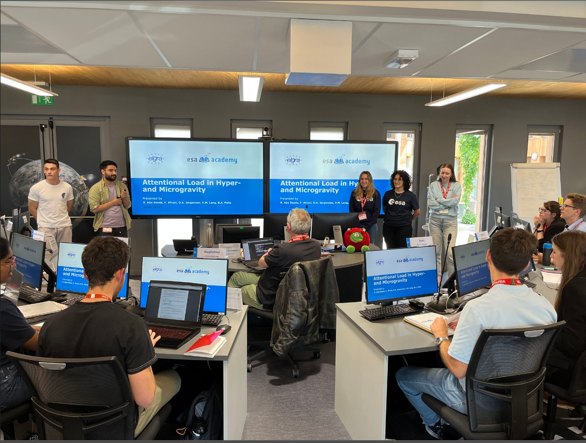

<!-- <h1 align="center"> Francesca's Digital Portfolio 🚀</h1> -->

Last updated: 2 January 2026
## Quick Navigation

- [🪐About Me](#About-Me)
- [🎓 Education & Background](#education)
- [🤖 DROVER - My Senior Design Project](#senior-design-project)
- [📖 Research](#research-experience)
- [🎯Grad School Projects](#grad-school-projects)
    - [Computational - Applied Planning & Optimization](#computational-applied-planning--optimization)
- [🛠 Undergrad Projects](#undergrad-projects)
    - [Computational Projects](#computational-projects)
    - [CAD & ANSYS Projects](#cad-and-ansys-projects)
- [🚁 Internships](#work-experience)
- [🚀 Additional Experience](#workforce-developments--summer-schools)
- [🏅 Honors & Scholarships](#achievements--funding)

## About Me

Hello and welcome to my digital portfolio!

My name is Francesca and I'm from a little town in Northern Italy but currently based in the USA.
Since a very young age I have always been fascinated by space and that has led me to earning my
<em>BS in aerospace engineering</em> and currently pursuing a
<em>MS in mechanical engineering</em> at Yale University.

I have served as <em>project manager and principal investigator</em> of my
<a href="#senior-design-project">senior design team</a>, and I have hands-on experience with a wide range
of computational, coding, and CAD tools
(<a href="#skills-languages--co-curriculars">full list here</a>).

My background spans from <a href="#research-experience">research</a> to
<a href="#work-experience">industry</a>, along with experience in preparing technical deliverables
such as PDRs, CDRs, SRRs, etc.

I’m eager to apply my skills, continue growing, and to contribute meaningful work to the future of
aerospace and space exploration!

--> **Please, feel free to contact me at francesca.afruni@yale.edu. CV, transcripts, and recommendations available upon request.** <--

[🔝 Back to Quick Navigation](#quick-navigation)

## Education

<ul>
  <li>
    <strong>B.S. Aerospace Engineering with Honors</strong>,
    Florida Institute of Technology, USA
    <em>(May 2025)</em>
    <ul>
        

          <li>
            Study Abroad (Calculus 3 and British Literature),
            University of Oxford, UK
            <em>(June 2022 – August 2022)</em>
          </li>
        

    </ul>
  </li>

  <li>
      

    <strong>M.S. Mechanical Engineering</strong>,
    Yale University, USA
    <em>(August 2025 – Expected: May 2026)</em>
      

  </li>
</ul>

<strong>Go Bulldogs 🐶</strong>

## Skills, Languages & Co-curriculars
**Engineering Skills**

*CAD Tools*: Creo PTC, Fusion 360, NX.

*ANSYS Software*: Fluent, APDL, Workbench (Static Structural).

*Coding Languages*: MATLAB, Simulink, Python.

*Others*: MS Office, 3D Printing, Laser Cutting, Soldering.

**Languages**

Italian (mother-tongue), English (Bilingual knowledge), Spanish (School-level)

**Soft Skills**

Team-work, Project Management, Communication, Problem Solving, Adaptability

**Co-curriculars**

GradSWE (Society of Women in Engineering) (outreach committee), WAE (Women in Aerospace Engineering), AIAA (American Institute of Aeronautics & Astronautics), ARES (Astrobiological Research & Education Society)

[🔝 Back to Quick Navigation](#quick-navigation)

## Senior Design Project 
### Project DROVER (Drone Rover Operations on Versatile Extra-hazardous Regions)

The primary objective of Project DROVER is to design, build, and fly a drone-rover hybrid prototype designed to enhance search and rescue operations capable of aerial and terrestrial navigation to locate and assist people in distress. This prototype will demonstrate the unique capability to land and drive when traversal via flying is not possible. Additionally, the vehicle will showcase the ability to execute turning maneuvers while airborne and land at an inclined angle. This hybrid vehicle holds the potential to revolutionize search and rescue operations by harnessing the energy efficiency of a rover combined with the agile air mobility of a drone. 
The unique dual-mode design of the DROVER opens a new wide range of possibilities for the utilization of technology to positively impact human lives. Its design is easily interchangeable to accommodate different possible versions (for example, to assist agriculture, military operations, search and rescue, and inspection of hazardous areas). 
This particular version will be focused on search and rescue operations, which often struggle with limited accessibility and time constraints. The DROVER will address these issues by providing quick and versatile navigation through both air and land. This version of DROVER targets emergency response units, including fire departments, search and rescue teams, and disaster relief organizations, aiming to improve their operational efficiency and effectiveness in challenging terrains. 

There are some important features to mention that help DROVER with the mission:

 • _FPV Camera & IR Camera_: the first is the eyes of the pilot and helps navigating DROVER as well as locating the potential victims, the second is to help pilot and DROVER locating potential rescuees trapped under rubble or debris.
 
 • _Microphone & Speaker_: DROVER is equipped with microphone and speaker to be able to engage in a two-way communication with the potential person in distress.
 
 • _Payload_: on the back of DROVER is possible to attach a small payload up to 600g, this is to manage to transport items like a 0.5L water bottle, medication, food, etc.

DROVER can be considered an overall success, as all its objectives were achieved!
These are some testing examples DROVER underwent:

 • Tested live video feed of FPV camera and IR camera during operations. 
 
 • Established 2-way verbal communication. 
 
 • Tested flying and driving capabilities of the prototype independently and combined.
 
 • Completed obstacle course with 600g payload, featuring 20° inclines and diverse terrains. 
 
 • Implemented automatic landing failsafe in case of controller signal lost and low system battery. 
 
 • Conducted endurance test resulting in a 15-minute hover time.

Read our **Final Report** [**HERE**](Docs/DROVER_FINAL_REPORT.pdf)

**FOR MORE ABOUT DROVER ON THE FLORIDA TECH SENIOR DESIGN SHOWCASE PAGE** [**CLICK HERE**](https://www.fit.edu/student-design-showcase/showcase-2025/aerospace-physics-and-space-sciences/)

Below you can see picures of DROVER in action while testing, some CFD analysis of the propellers I personally completed, an example output from the IR camera, and the poster that was presented at showcase!

•	Deliverables: SRR (completed), PDR (completed Dec. 2024), CDR (completed Feb. 2025), _Poster and Presentation_ at the Northrop Grumman Engineering & Science Student Design Showcase (completed Apr. 2025)

[🔝 Back to Quick Navigation](#quick-navigation)

## Research Experience
### Project ASTTRO (Astronomy Space Telescope Thermal Research and Optimization) (_November 2023 - August 2024_)
**SPACE Lab - Dr. do Vale Pereira**

The project's main objective is to propose a design for a large observatory that will orbit around Earth in a highly eccentric orbit with an apoapsis close to the lunar orbit. My role was more focused on the thermal aspects of the telescope; Calculating the effects of the thermal environment on the telescope structure, with more emphasis on the mirrors to check for survivability and optical stability in given conditions. 
Engaging in research has proven to be an exceptional experience. The practical application of knowledge acquired from lectures and laboratories has made me aware of the importance of details and how vital interconnections between different subjects are in engineering projects, highlighting the importance of teamwork in developing a high-quality project. 

[**Publication on SPIE Click Here**](https://doi.org/10.1117/12.3020407)

**ASTTRO Team in front of the TVAC at the University of Arizona**

### RedHouse Project – Dr. Andrew Palmer Laboratory (_September 2021 – May 2022_)
I have volunteered in Dr. Andrew Palmer’s “Red House”, a greenhouse where I tended to tomato plants grown in conditions that emulated the ones humans would have to face while farming on Mars; the experiment was so successful that Heinz Tomato Ketchup created a limited run of prototype [bottles “Marz Edition”](https://news.fit.edu/academics-research/heinz-marz-edition-ketchup-made-possible-by-florida-tech-science/) from the crops.

[🔝 Back to Quick Navigation](#quick-navigation)

## Grad School Projects
### Computational: Applied Planning & Optimization
For my Applied Planning and Optmization class I developed (using Python) a path-planning algorithm that uses A* in order to find the safest path in terms of elevation for martian rovers. In this project I integrated real NASA elevation data by analyzing an orbiter picture of the Jezero crater. The steeper and higher, the more dangerous it is to traverse for the rover, and therefore, the higher the cost will be. I utilized the library "rasterio", which manipulated the image to get the elevation, and then created the figures using the classic "matplotlib". The code runs two different A* applications, a “standard” one, which only accounts for the distance, and a “terrain-aware” one, which implements the terrain-aware cost. 

I have a dedicated page where you can see my full project write up, including Google Colab link for the algorithm, and output figures: 
[https://www.notion.so/Final-Project-2ad7c2fd6b72804494f5f74c98317863?source=copy_link]

This is just the Google Colab link if you are interested only in the algorithm: [https://colab.research.google.com/drive/1-Pl9fBFVdfNhcafQiDBtkcJlCS_wEYLe?usp=sharing]

[🔝 Back to Quick Navigation](#quick-navigation)

## Work Experience
### Leonardo Helicopters Intern – AWPC, Philadelphia, PA (_May 2024 – Aug 2024_)
•	Worked as an Aircraft System Integration (ASI) Engineering Intern on the Flight Mechanics team of the AW609 (Tilt-Rotor) program

•	Flight Data Analysis. Analyzed mast torque and engine power losses in AW609 flight tests, produced flight envelope plots under varying conditions, and conducted comparative blade studies using programs such as JPanda, PyPanda, iMission, Excel, MATLAB, and Python

•	Conducted compliance checks and formatted test reports and plans, ensuring adherence to established rules and standards

•	Produced performance data tables for the Tokyo Metropolitan Government, supporting potential AW609 operations at Ogasawara and contributing to future business opportunities with TMG.

•	Gained knowledge in helicopter flight mechanics and tiltrotor technologies, actively assisting in telemetry and flight simulations for the AW609 aircraft

[🔝 Back to Quick Navigation](#quick-navigation)

## Workforce Developments & Summer Schools
### NASA Mission Concept Academy (_Jan 2024 – May 2024_)
Served as **Deputy Project Manager** in a NASA workforce development program focused on mastering exploration mission protocols and industry practices led by NASA professionals. Collaborated with a team to apply professional practices and procedures, enhancing project management skills and understanding of NASA's exploration processes.
Deliverables: Team Organizational Chart, MCR, SRR, MDR, PDR, PDR Presentation

[Read our PDR Here](Docs/PDR%20TEAM%202_MCA.pdf)

•	Deliverables: Team Organizational Chart, MCR, SRR, MDR, PDR, PDR Presentation

### ESA/EGRA Gravity-related Research Summer School – ESEC-Galaxia, Belgium (_June 2023_)
In June 2023, I was selected to be part of the ESA/ELGRA Gravity-Related Summer School, where I got to fly to Belgium and experience a blended format of lectures, workshops, and team activities on altered-gravity experiments. Learning from experts affiliated with ESA and ELGRA, who freely shared their expertise in biology, human physiology, physics, and engineering, has been truly enriching. However, the most rewarding experience has been encountering an incredibly diverse and talented group of young students from universities all over Europe, creating a stimulating and supportive environment. As part of completing the Summer School, we were divided into groups to complete a multidisciplinary team project. The teams were structured to feature completely different backgrounds: engineers, biologists, neuroscientists, and doctors, all from different countries. Diving into unfamiliar subjects made the project challenging; for example, our project consisted of testing human’s attentional load in altered gravity, which focused mostly on neuroscience, something quite different from engineering. It was incredibly gratifying to see how different branches of STEM subjects intertwine and are necessary to one another and how we managed to each use our skills and different backgrounds to achieve a successful experiment. 

**Saturn Team Presenting at ESA**

### NASA Proposal Writing and Evaluation Experience Academy (_May 2023 – Aug 2023_)
NASA Proposal Writing and Evaluation Experience Academy (NPWEE), a four-month workforce development held by NASA and Arizona State University designed to **teach proposal writing** and enhance effective teaming practices and soft skills. Contributed as an engineer to a team that researched and crafted a New Technology Proposal for NASA, showcasing innovative solutions and technical expertise. Played a key role as a secondary reviewer, assessing and scoring proposals from other teams, which honed critical evaluation skills and provided valuable insights into the proposal review process

[Read the Proposal Here](Docs/FULL%20PROPOSAL%20DOCUMENT%20TEAM%2028_NPWEE.pdf)

•	Deliverables: Taxonomy Topic Interest, Quad Chart, Org Chart, Shell Doc, Proposal, Review Panel

[🔝 Back to Quick Navigation](#quick-navigation)

## Undergrad Projects

### Computational Projects

### Space Vehicle Control Class - Final Project (_Fall 2024_)
The objective of this project was to design the Attitude Determination and the Control System of a space vehicle simulating the Early Orbit Phase of a Medium Earth Orbit. The space vehicle had to detumble within its first ten orbits, and its angular velocity (𝜔) had to reduce to less than 0.2 RPMs. Once de-tumbled, the space vehicle had to rotate so that its −𝑏3 vector pointed to the center of the Earth for better communications. Finally, the space vehicle also had to align its 𝑏 2 vector with the velocity vector.  The only components available for the project were up to three Magnetorquers (MTQ) with a maximum of 500 mA each, up to five Reaction Wheels (RW), and three sensors: a magnetometer, a sun sensor, and a gyro. 

[Read the whole project document here](Docs/SVC%20Project%20-%20Afruni.pdf)

### Aerospace Computational Techniques Class - Final Project (_Spring 2024_)
The objective of this project is to simulate the uneven Martian terrain to demonstrate the capability of a drone to navigate through an unexplored environment. The UAV Toolbox in MATLAB provides the necessary tools to design, simulate, and test unmanned aerial vehicles (UAVs) and advanced air mobility (AAM) applications. Key features of the toolbox include designing flight controllers, developing autonomy algorithms, and planning UAV missions. 
Note: the names of my teammates have been redacted for privacy reasons.

[Read the whole project document here](Docs/ACT%20Project_Final_namesredacted.pdf)

[🔝 Back to Quick Navigation](#quick-navigation)

### CAD and ANSYS Projects

### Computer Aided Engineering - Final Project (_Spring 2025_)
*Objectives*:

You are the owner of a small engineering firm bidding on a NASA SBIR project. The objective of the project is to design a hand-operated cutting tool that is able to cut a 30-mm diameter cable by applying a 500 N normal force at the cutting blade. The tool must be compact enough to fit in a box with dimensions 40 cm x 10 cm x 5 cm. You are free to use any design that meets these constraints. Your design will compete against other bidding firms’ designs, and the contract will be awarded based on evaluation criteria such as: (a) minimum weight, (b) compactness, and (c) minimum cost. 

*Design requirements*:

The cutting tools must: 

• Be capable of applying a 500 N normal force onto a 30-mm diameter cable using no more than 45 N applied force (your hands) 

• Fit within a 40 cm x 10 cm x 5 cm storage box when fully assembled. 

• Require no more than two hands to operate in a zero-gravity environment. 

• Have no more than a 20° angle between the jaws when the 30-mm cable is placed between the jaws. 

Read our Final Report [HERE](Docs/MEE3024_PROJECTREPORT_AFRUNI_BERADUCCI_KINKADE.pdf)

Pliers fully extended:

Pliers retracted:

### Menzi Muck CAD Modeling (_Fall 2023_)
Modeled a Menzi Muck for CAD class project with CREO PTC.

[More Details Here](Docs/MEE2024_FinalProject_Group4.pdf)

### Freshman Design Project (_Spring 2022_)
The purpose of this project was to design and build a glider. The requirements included size  (4 ft x 4 ft x 1 ft) and total mass (4.41lb) constraints. A payload bay had to be included for the accommodation of a small object of 43g (included in the total mass of the glider) and size 4 in x 3 in x 5 in. The glider could not include pre-shaped components from any kit, batteries, electronic motors, or any energy source. The materials allowed for the realization of the glider were balsa wood sheets, 3D printing wire, dowel rods, and Expanded Polystyrene Foam. The total budget of the project couldn’t exceed $50.

[🔝 Back to Quick Navigation](#quick-navigation)

## Other Projects

### Mars Plant Challenge (_Fall 2021 - Spring 2022_)
Although my studies are more focused on airplanes and rockets, I am aware of the importance of all STEM subjects to space exploration. At Florida Tech, I have been very active in the Astrobiological Research and Education Society (ARES), where I have been part of a team of undergraduate students who managed to grow Oyster mushrooms in simulant Martian regolith, with the main objective to understand how to feed a crew in space, maximize resources, and forward all research to NASA’s lunar program Artemis. The team, the “Florida Tech Fungis”, won “Best Plant Growth”, “Most Innovative Experiment”, and “Best Evaluation Results” prizes in the professional division of the competition. 
[Click here to read what Florida Tech wrote about us!](https://news.fit.edu/panther-bites/student-team-wins-best-in-show-at-plant-moon-mars-challenge/?fbclid=IwAR36YlYfje_kMLPEJw-eJnnzu9fiswfn-1FLrZU32aJyluOpPblcj4fR1p8&fs=e&s=cl)

[Read our first report here](Docs/FINAL%20REPORT_PLANTMARS.pdf)

**Oyster Mushroom grown by the team!**

 

### Space Ambassador (_Spring 2021_)
I wrote about space companies that are solving challenges on Earth.
Here's one of my [articles](https://www.spaceisforyou.com/blog-details/leonardo-from-earth-to-space/r/reck294Al2G1J3Dnv) about Leonardo (for which I would go intern two years later!)

[🔝 Back to Quick Navigation](#quick-navigation)

## Achievements & Funding

- **Tau Beta Pi Honors Society**	[_2023 – Present_]

  Honored for academic excellence, for ranking among the **top 1/8 of the junior class** and **top 1/5 of the senior class** at F.I.T.

- **Dean’s List** (Florida Tech) [_2022 – 2025_]
  
  Recognized for maintaining high academic performance

- **Distinguished Student Scholar** (Florida Tech) [_April 2024_]
  
  The distinguished student scholars are undergraduate students who have completed more than 55 credit hours at Florida Tech with cumulative GPAs of 3.8/4.0 or higher

- **Outstanding Student of the Year** – Department of Aerospace, Physics, and Space Sciences (Florida Tech) [_April 2024_]

  The awards recognize well-rounded, active student-scholars, selected by their academic units, who have made contributions to their academic program, university, and community

- **Panther Fund Transfer Scholar Scholarship** (Florida Tech) [_August 2021 – May 2025_]

  Secured a prestigious **$40,000** scholarship, granted over four years, in recognition of academic excellence and potential

- **Oxford Study Abroad Scholarship Award** (Florida Tech) [_June – August 2022_]
  
  Recipient of the **$1,300** Scholarship for good academic standing (GPA > 3.75) and leadership

### **Professional Full-Time Eventing Rider for Team Italia**
  - **Eventing Team Italia U21** (2018 - 2019)
  - **Team Italia Squad U21 _CCIYR3 Eventing European Championships_, Maarsbergen NL** (2019)
  - Eventing Athlete of National Interest (2020 - 2022)
  - 5th place Italian Young Rider U21 Eventing Championships CCI3* (2019) 
  - Several Placements at International Level (2018 - 2021)
  - Silver Medal at Italian Eventing Championships CNC1*(2016)
  - Three Gold Medals and six Top10 places at Regional Level in all three Equestrian Olympic disciplines (2014-2020).
  - Moved to the UK to compete and work as working-pupil for World Equestrian Games and Olympic riders Giovanni Ugolotti and Kathryn Robinson (Summer 2016)
  
 

[🔝 Back to Quick Navigation](#quick-navigation)
